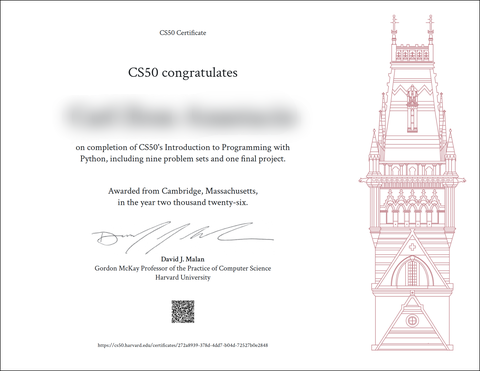

# CS50p

[CS50’s Introduction to Programming with Python](https://cs50.harvard.edu/python/)

- [Week 0 - Command Line, Python Basics](./week0/README.md)
- [Week 1 - Basics, Strings, Conditionals](./week1/README.md)
- [Week 2 - Control Flow, Loops](./wesek2/README.md)
- [Week 3 - Functions, File I/O](./week3/README.md)
- [Week 4 - Lists, Dictionaries, JSON](./week4/README.md)
- [Week 5 - Testing, Pytest](./week5/README.md)
- [Week 6 - Files, CSV, Exceptions](./week6/README.md)
- [Week 7 - Regular Expressions](./week7/README.md)
- [Week 8 - OOP, Classes](./week8/README.md)
- [Week 9 - Advanced Topics, Et Cetera](./week9/README.md)

_*This repository serves as my personal storage and practice space for the Harvard CS50’s Introduction to Programming with Python (CS50P) course. All problem sets, exercises, and experiments related to the course will be stored here.*_

### Certificate
